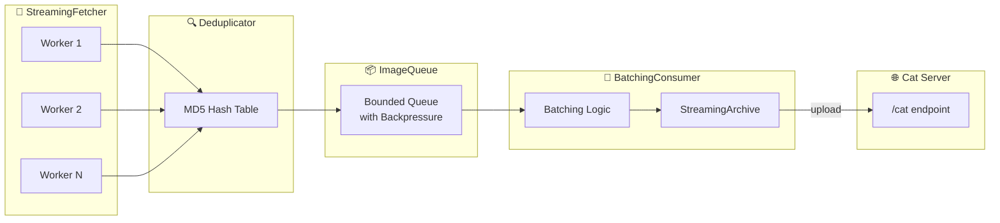

# Cotichi

Async cat archive service in Lua. Fetches cat images, deduplicates, packs into ZIP and uploads.

## Quick Start

```bash
docker-compose up --build
```

## Features

- Continuous streaming pipeline (long-running service)
- Async HTTP with Copas
- Parallel fetching (configurable workers)
- Per-archive MD5 deduplication
- Incremental ZIP archives
- Graceful shutdown (SIGINT/SIGTERM)

## Architecture



**How it works:**
1. **Workers** fetch cats from API in parallel
2. **Deduplicator** filters duplicates by MD5 hash (resets after each archive)
3. **ImageQueue** buffers images with backpressure
4. **BatchingConsumer** writes to ZIP, uploads when 12 cats collected, repeats forever

## Configuration

All settings can be configured via environment variables:

### API Settings

| Variable | Default | Description |
|----------|---------|-------------|
| `CAT_API_URL` | `http://algisothal.ru:8889` | Production API URL |
| `CAT_API_DEBUG_URL` | `http://algisothal.ru:8890` | Debug API URL (no delay) |
| `USE_DEBUG_API` | `false` | Use debug endpoint (`true`/`1` to enable) |
| `UPLOAD_ENABLED` | `true` | Upload archive to server (`false` to disable) |

### Async/Concurrency Settings

| Variable | Default | Description |
|----------|---------|-------------|
| `NUM_WORKERS` | `24` | Number of parallel fetch workers |
| `QUEUE_SIZE` | `25` | Image queue buffer size |
| `TIMEOUT` | `20` | HTTP request timeout (seconds) |
| `RETRY_COUNT` | `3` | HTTP retry attempts |
| `RETRY_DELAY` | `1` | Initial retry delay (seconds, exponential backoff) |

### Archive Settings

| Variable | Default | Description |
|----------|---------|-------------|
| `TARGET_COUNT` | `12` | Number of cats per archive |
| `OUTPUT_DIR` | `/app/output` | Output directory for local saves |
| `SAVE_LOCAL` | `false` | Save archive locally (`true`/`1` to enable) |

### Service Settings

| Variable | Default | Description |
|----------|---------|-------------|
| `LOG_LEVEL` | `INFO` | Log level: `DEBUG`, `INFO`, `WARN`, `ERROR` |

## Commands

```bash
make build       # Build image
make run         # Run service
make run-debug   # Debug mode (no delay)
make test        # Run tests
```

## License

VIBE
